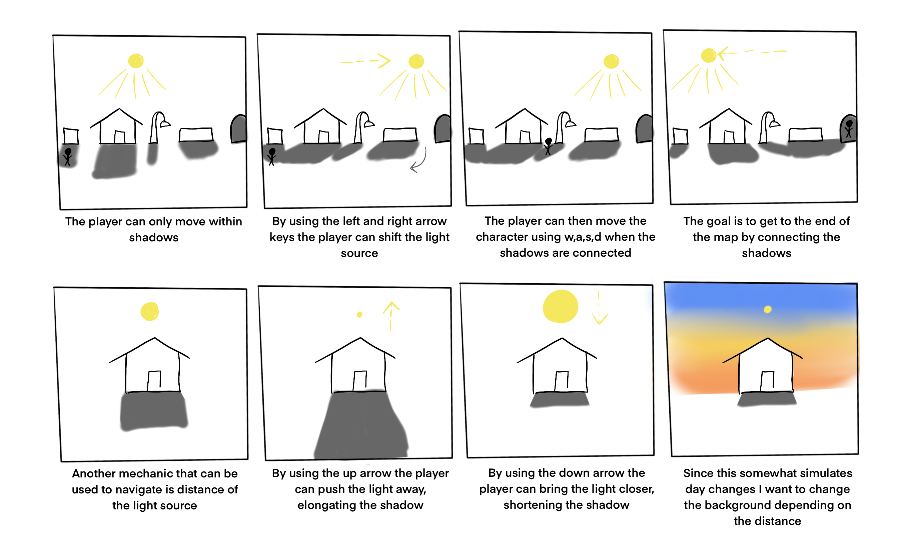

# Final Project: Proposal

## Description

For my final project, I would like to create a game where the player is a shadow being that can only exist within shadows. The player will be able to change the location and distance of the light source, the sun, which will change the shadows in the environment. The goal of the game is to line up the shadows to reach the end of the level. This game will be a top down puzzle game consisting of different levels.

## Storyboard

## Inspiration
#### SCHiM
[https://store.steampowered.com/app/1519710/SCHiM/](https://store.steampowered.com/app/1519710/SCHiM/)

This is my main inspiration for this game and is very similar to the one I would like to create. I like how the player can jump from shadow to shadow in SCHiM, however, I want to have the main game mechanic being the control of the light.

#### Shadows
[https://store.steampowered.com/app/563380/Shadows/](https://store.steampowered.com/app/563380/Shadows/)

This game has a similar vibe to the one that I would like to create. I like the color palette and the creatures in this game.
